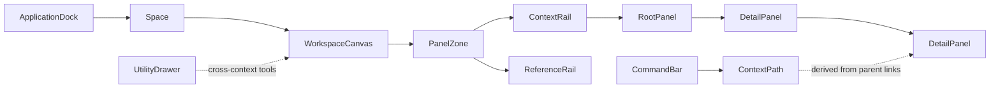

# Frameword concept brief

> Reçu le 2026-07-19 (produit dans une autre session, collé par l'opérateur).
> **Statut : concept canonique v2** — remplace le modèle « pile plate » de
> `PANEL-LOGIC.md` §1–3 pour la machine d'état. Voir `BRIEF-REVIEW.md` pour la
> revue critique, les objections et la carte de réconciliation.

Status: discovery draft, 2026-07-19. No application implementation is implied by this document.

Decision labels used here:

- **Direction:** the product thesis and separation of concerns to keep.
- **V1 hypothesis:** a concrete rule to prototype and falsify before freezing the API.
- **Future delivery target:** packaging proposed for later implementation, not an installed package today.

## Decision

Build Frameword as a **context-preserving workspace framework for operational software**, not as another dashboard template.

> Frameword lets people open related records beside their source, investigate or act, and keep the thread of how they got there.

Working tagline: **Open the detail. Keep the thread.**

The LifeOS handoff is the first UX specimen. Its reusable contribution is the contextual panel-navigation grammar. Its life-management schema, AI coach, Clerk/Stripe choices, and WhitePaper styling are example-app concerns.

## Problem and promise

Conventional dashboards repeatedly replace the current route with a detail page. Users then reconstruct context through Back, duplicated tabs, or memory. This becomes expensive in relational workflows such as customer → contract → invoice → payment, project → issue → run → log, or collection → document → citation.

Frameword makes the relationship visible:

1. A Space opens a RootPanel.
2. A DrillTrigger opens a related DetailPanel beside its source.
3. The source remains visible where the viewport allows it.
4. The ContextPath represents current semantic ancestry; the Next.js adapter records transitions between encoded paths in browser history.
5. A user may keep selected records as explicit references without corrupting ancestry.

The framework is best when the work is relational, investigative, and several levels deep. It is a poor fit for shallow KPI pages, marketing sites, mobile-first consumer flows, and freeform window management.

## Product boundaries

Frameword is:

- a navigation grammar and state model;
- a headless, serializable panel router;
- accessible React primitives;
- a responsive presentation contract;
- a shadcn registry of open-code UI components;
- a first-party Next.js routing adapter;
- an optional Convex persistence adapter;
- a starter application and conformance suite.

Frameword is not:

- a chart library;
- a bundle of dashboard cards;
- a visual theme;
- an admin template;
- a backend or business schema;
- a freeform desktop/window manager;
- a universal replacement for pages, tabs, dialogs, or drawers;
- the LifeOS product or its AI assistant.

## What to preserve and what to change

| From the LifeOS handoff | Decision for Frameword |
|---|---|
| Opening related content to the right preserves context | Preserve as the signature interaction |
| Stable panel header, body, and optional action footer | Preserve as the base anatomy |
| Preview versus pinned behavior | Preserve the intent, replace the ambiguous state rules |
| Global utility drawer outside the content trail | Preserve |
| Fixed header alignment and semantic width recipes | Preserve as layout defaults |
| A single flat array is both breadcrumb and visual order | Replace with explicit semantic ancestry plus visual order |
| Render functions are stored in navigation state | Replace with serializable descriptors resolved by a registry |
| Reopening an existing panel is a no-op | Reveal the same target in the same context; allow a separate instance under a different semantic parent |
| Closing one middle panel leaves later panels alive | Close its attached subtree or explicitly detach retained references |
| Any child panel can be reordered | Restrict reorder to detached references |
| “Infinite depth” means unlimited visible columns | Treat depth as a routing capability; enforce a mounted-panel budget |
| No pages, tabs, or dialogs | Panels are the content-navigation default; use other patterns where semantically correct |
| Every primary action must be in the footer | Persistent resource-level commit/create actions use the footer; local actions stay near their object |
| Modules never mix | Default scope policy, configurable for cross-domain references |
| Optical centering and full-height chat are router laws | Move to visual recipes |
| WhitePaper typography and colors define the system | Ship them as an optional theme preset |
| Convex, Clerk, Stripe, and Anthropic are mandatory | Keep vendor choices in adapters or starters |

## Canonical model



The most important distinction is:

- **ContextPath** is the current semantic ancestry of the active context leaf. It drives breadcrumbs, close behavior, and deep links.
- **ContextRail** is the presentation derived from ContextPath; it is not stored as a competing ordered source of truth.
- **ReferenceRail** is the separately ordered set of detached pinned references.
- **PanelRail** is the shared layout primitive used to render either concrete rail.

Visual order must never be treated as proof of parentage.

## Canonical terminology

| Concept | Public term | Component/API example |
|---|---|---|
| Product area | Space | `openSpace()` |
| Space launcher | ApplicationDock | `ApplicationDock` |
| Global command surface | CommandBar | `CommandBar` |
| Main application surface | WorkspaceCanvas | `WorkspaceCanvas` |
| Panel viewport | PanelZone | `PanelZone` |
| Generic spatial rail primitive | PanelRail | `PanelRail` |
| Active ancestry presentation | ContextRail | `ContextRail` |
| Detached reference presentation | ReferenceRail | `ReferenceRail` |
| Focused semantic ancestry | ContextPath | `getContextPath()` |
| Content surface | Panel | `Panel` |
| First content surface | RootPanel | `RootPanel` |
| Related record surface | DetailPanel | `DetailPanel` |
| Related-record link | DrillTrigger | `DrillTrigger` |
| Transient detail | PreviewPanel | `retention: "preview"` |
| Retained record | PinnedPanel | `pinPanel()` |
| Global overlay | UtilityDrawer | `UtilityDrawer` |
| Persistent action region | PanelFooter | `PanelFooter` |

Do not use `Sheet` for Frameword's in-page panels. shadcn uses Sheet for an edge overlay, so reusing that term would make the public API misleading.

## Serializable navigation contract — V1 hypothesis

Navigation state contains identifiers and JSON only. Components, closures, fetched rows, callbacks, and backend-specific type imports do not belong in it. An opaque serialized application ID may be part of `resourceKey`.

```ts
type JsonValue =
  | null
  | boolean
  | number
  | string
  | JsonValue[]
  | { [key: string]: JsonValue };

type PanelTarget = {
  panelType: string;
  resourceKey: string;
  params: Record<string, JsonValue>;
};

type PanelRole = "root" | "detail";
type PanelRetention = "preview" | "retained";
type PanelPlacement = "context" | "reference";

type PanelInstance = {
  instanceId: string;
  target: PanelTarget;
  spaceId: string;
  parentInstanceId: string | null;
  role: PanelRole;
  retention: PanelRetention;
  placement: PanelPlacement;
  size: "sm" | "md" | "lg";
};

type WorkspaceState = {
  schemaVersion: 1;
  spaceId: string | null;
  rootInstanceId: string | null;
  contextLeafId: string | null;
  focusedPanelId: string | null;
  panelsById: Record<string, PanelInstance>;
  referenceRailOrder: string[];
  utilityTarget: PanelTarget | null;
};
```

A typed panel registry resolves each `panelType` to its renderer, target validator, label resolver, URL codec, size default, and supported capabilities.

Attached-instance identity is context-scoped in V1:

```text
contextInstanceKey = spaceId + panelType + resourceKey + parentInstanceId
referenceKey       = spaceId + panelType + resourceKey
```

Opening the same target from the same contextual parent reveals it. Opening it from a different parent creates a distinct attached instance because it represents a different thread. A Space contains at most one detached reference for a canonical target.

Public commands should describe user intent:

- `openSpace()`
- `openDetail()`
- `revealPanel()`
- `focusPanel()`
- `navigateUp()`
- `pinPanel()`
- `unpinPanel()`
- `resumeReference()`
- `closePanel()`
- `closeBranch()`
- `reconcileLocation()`
- `restoreWorkspace()`
- `openUtility()`

Avoid implementation-shaped public verbs such as `push`, `append`, and `popTo`.

## Engine invariants

1. A workspace has at most one RootPanel.
2. Every panel has a stable instance ID, canonical resource key, valid panel type, Space, and explicit parent semantics.
3. Every non-root attached panel has a reachable parent; cycles and orphans are invalid.
4. A RootPanel is retained, placed in context, and has no parent. A reference is retained, placed in ReferenceRail, and has no active parent.
5. `contextLeafId` and `focusedPanelId` are explicit and independent. Array position never implies either.
6. ContextPath and ContextRail are derived from parent links, never from stored visual order.
7. At most one PreviewPanel exists for a given source branch.
8. The same target from the same parent reveals and focuses its attached instance. A different parent may create another instance; references deduplicate by canonical target within a Space.
9. Closing a parent applies a declared subtree policy and cannot silently orphan descendants.
10. Active ancestry cannot be arbitrarily reordered. Only reference panels may be reordered.
11. Every state snapshot validates and round-trips through a versioned codec.
12. `navigateUp()` changes ancestry directly. Browser Back/Forward belongs to the router adapter, which parses the destination URL and dispatches `reconcileLocation(destination)`; Back is not assumed to mean “parent.”
13. Opening a panel focuses its labelled heading; closing restores the originating trigger when it still exists.
14. Overlay dismissal has deterministic precedence before panel dismissal.
15. Dirty panels participate in `beforeClose` and `beforeReplace` guards.
16. Every panel supports loading, empty, error, not-found, permission-lost, offline, stale, and deleted-resource states.
17. Logical depth may be unbounded; mounted and simultaneously visible depth has an explicit performance budget.

## Pinning model — V1 hypothesis

Pinning must not mean “ignore ancestry rules.” Use two visible groups:

- **ContextRail:** the RootPanel and active branch derived from ContextPath. Parent-child order is fixed.
- **ReferenceRail:** detached retained resources for comparison or recall. These may be reordered.

V1 uses one deterministic transition model:

1. `pinPanel()` changes an attached panel's `retention` from `preview` to `retained`; it stays in ContextPath while that branch remains active.
2. If a later branch replacement or ancestor close would orphan it, the reducer sets `placement: "reference"`, clears `parentInstanceId`, and adds its existing instance ID to `referenceRailOrder`.
3. Unretained descendants close. Each retained descendant detaches as its own reference.
4. `unpinPanel()` on an attached panel restores `retention: "preview"`. On a detached reference, it closes that reference.
5. `resumeReference()` removes the reference from ReferenceRail and asks the route adapter to reconstruct a fresh active ContextPath for its target.
6. ContextPath alone is URL-shareable. ReferenceRail is device-local unless the user explicitly saves a named workspace.
7. If detaching would create a duplicate `referenceKey`, the existing reference wins, is revealed, and the newly detached instance is discarded. Reference identity is resource-level in V1, not origin-path-level.
8. RootPanel cannot be pinned or moved.

For the first release, use one safe policy: changing Space clears both rails unless the application explicitly enables cross-Space references.

## Adaptive presentation

The state model remains identical at every size; only presentation changes.

| Environment | Presentation |
|---|---|
| Wide desktop | Multiple adjacent active-path panels; references in a separated rail |
| Compact desktop/tablet | Focused panel plus one ancestor preview or collapsible context strip |
| Phone/narrow container | One focused panel; Navigate Up reaches the parent, browser Back follows URL history, and references live in a tray |
| RTL | Logical inline-start/inline-end placement, not hard-coded left/right |
| 200% zoom | Reflow to the single-panel mode before horizontal content clipping |
| Reduced motion | Preserve focus and context changes without animated travel |

Use container queries for embedded dashboard surfaces. Horizontal scrolling may enhance desktop orientation, but it cannot be the only navigation mechanism.

## Accessibility contract

- Every Panel is a labelled region with a real heading.
- Opening announces the new context and moves focus to its heading or first meaningful control.
- Closing restores focus to the DrillTrigger that opened it when possible.
- Pin controls expose state with `aria-pressed` and accessible labels.
- Breadcrumbs are real links or buttons with current-state semantics.
- DrillTrigger is a real link with a valid `href`, progressively enhanced by the client router.
- Keyboard users can traverse visible panels without tabbing through every control in every ancestor.
- Escape precedence is: popover/menu → dialog → UtilityDrawer → active panel → RootPanel/home.
- A desktop UtilityDrawer may be nonmodal and must keep a coherent tab order. In the narrow-screen overlay form it is modal, traps focus, makes covered content inert, receives initial focus, and restores focus to its trigger on close.
- The implementation defines forced-colors, high contrast, touch target, zoom/reflow, translated-label, and screen-reader behavior.
- A horizontal rail is not automatically an ARIA tree. Apply tree semantics only when the contained data and keyboard behavior actually implement that pattern.

## Recommended package architecture — future delivery target

```text
@frameword/panels-core
        ↑
@frameword/panels-react ─── @frameword/panels-next
        ↑                         ↑
@frameword/ui registry      @frameword/panels-convex
          \                     /
           create-frameword-workspace
                       ↑
                 examples/lifeos
```

### `@frameword/panels-core`

- TypeScript only.
- State types, reducer/state machine, commands, invariant validation, migrations, and codec interfaces.
- No React, CSS, Next.js, Convex, authentication, AI, or domain data.

### `@frameword/panels-react`

- Client provider, hooks, renderer registry, focus manager, keyboard commands, scroll/reveal orchestration, and per-panel error/Suspense boundaries.
- Stores descriptors; registry entries resolve them to components.

### `@frameword/ui` shadcn registry

- Open-code components such as `Panel`, `PanelHeader`, `PanelBody`, `PanelFooter`, `PanelZone`, `PanelRail`, `ContextRail`, `ReferenceRail`, `DrillTrigger`, `PanelBreadcrumb`, `ApplicationDock`, `CommandBar`, and `UtilityDrawer`.
- Neutral tokens plus optional WhitePaper/Swiss-terminal preset.
- Registry items may also distribute Frameword rules, docs, and prompt files.

### `@frameword/panels-next`

- App Router route parsing, initial server-to-client hydration, `PanelLink`, history synchronization, and application-owned readable URL codecs.
- Use a catch-all or domain route to reconstruct the active ContextPath, then run the dynamic panel rail as an interactive client boundary.
- Do not create one Next.js parallel-route slot per dynamic panel. Parallel-route slots are statically named and have distinct hard-navigation fallback behavior; they are useful for known layout slots, not an arbitrary-length rail.

### `@frameword/panels-convex`

- Optional named workspace, layout preference, and cross-device snapshot persistence.
- Accepts an application-supplied authenticated subject; it must not depend on Clerk or assume a `users` table.
- Does not own application domain records.
- Does not persist every transient click.
- Preferred packaging hypothesis: a Convex Component with isolated schema/functions plus application-side wrapper functions for authentication. If the component boundary proves too restrictive, distribute generated application-owned Convex files instead; validate this choice in Phase 0.

Suggested persistence precedence:

1. URL ContextPath.
2. Explicitly selected saved workspace.
3. Device-local session snapshot.
4. Framework defaults.

### `create-frameword-workspace`

- Opinionated Next.js + shadcn + Convex starter.
- Owns stack versions, auth choice, sample schema, generated components, and deployment setup.

### `examples/lifeos`

- Rebuilds the old specimen using only public Frameword APIs.
- Demonstrates deep relational navigation and the optional WhitePaper theme.
- Never becomes the source implementation for core packages.

## Why this delivery shape fits the stack

- shadcn explicitly treats itself as open code plus a distribution platform, and its registry can distribute components, hooks, pages, configuration, rules, and other files. Frameword UI and prompt assets fit that model better than a closed styling package.
- Next.js layouts preserve state during client navigation, while a validated URL ContextPath supplies refresh and deep-link truth.
- Convex reactive queries and optimistic mutations fit data shown concurrently in parent and detail panels. The panel router should still remain backend-independent.
- Convex Components can package isolated schemas, functions, and persistent state, which makes them the leading hypothesis for the optional saved-workspace backend.
- Convex server-rendering support is currently documented as beta, so the framework should make preloading an adapter capability rather than a core assumption.

## Validation strategy before freezing the API

Build three unrelated specimen workflows:

1. CRM: account → contact → opportunity → activity.
2. Issue operations: project → issue → run → log line.
3. Knowledge: collection → document → citation → source.

For each specimen, measure:

- time to target;
- reopening and backtracking count;
- wrong-context actions;
- orientation confidence;
- keyboard-only completion;
- phone completion;
- restore/deep-link success;
- performance with deep paths and many references.

LifeOS is a fourth showcase, not the only proof.

## Phase 0 deliverables

This brainstorming phase should validate or reject the V1 hypotheses before any public package API is treated as final. It should end with:

1. approved category statement and terminology;
2. a transition table for every engine command;
3. URL and persistence precedence decisions;
4. desktop, compact, phone, RTL, and accessibility behavior specs;
5. one low-fidelity CRM prototype to test generality;
6. conformance scenarios written before implementation;
7. a package and registry manifest;
8. a decision on whether `Frameword` is the permanent brand or only the working title.

Do not begin with the LifeOS Convex schema or ten dashboard layouts. First falsify the navigation model with an in-memory reducer and unrelated domains.

## Evidence and current references

Handoff source: `/Users/hacker/Downloads/lifeos-handoff.zip`.

Key internal evidence:

- `lifeos/project/PANEL-BEHAVIOR-SPEC.md:11-22` — original context-preserving promise.
- `lifeos/project/PANEL-BEHAVIOR-SPEC.md:81-120` — old ten laws mix state, layout, typography, and a chat recipe.
- `lifeos/project/PANEL-BEHAVIOR-SPEC.md:175-193` — claimed serialization and accessibility behavior.
- `lifeos/project/design-system-update/panel-engine.jsx:9-51` — actual closure-based flat array, pin preservation, close, and reorder behavior.
- `lifeos/project/design-system-update/panel-engine.jsx:68-130` — host and panel shell lack the promised focus manager.
- `lifeos/project/lifeos.css:383-435` — desktop horizontal rail and fixed panel anatomy.
- `lifeos/project/screenshots/04-cols4.png` — limited usable context at a 924px-wide capture.
- `lifeos/project/screenshots/pin.png` — screenshot generation that conflicts with the later “modules never mix” rule.

Current primary documentation:

- [shadcn/ui introduction](https://ui.shadcn.com/docs)
- [shadcn registry](https://ui.shadcn.com/docs/registry)
- [shadcn registry namespaces](https://ui.shadcn.com/docs/registry/namespace)
- [Next.js App Router](https://nextjs.org/docs/app)
- [Next.js layouts and pages](https://nextjs.org/docs/app/getting-started/layouts-and-pages)
- [Next.js parallel routes](https://nextjs.org/docs/app/api-reference/file-conventions/parallel-routes)
- [Convex with the Next.js App Router](https://docs.convex.dev/client/nextjs/app-router/)
- [Convex server rendering](https://docs.convex.dev/client/nextjs/app-router/server-rendering)
- [Convex realtime](https://docs.convex.dev/realtime)
- [Convex optimistic updates](https://docs.convex.dev/client/react/optimistic-updates)
- [Convex Components](https://docs.convex.dev/components)
- [WAI-ARIA tree view pattern](https://www.w3.org/WAI/ARIA/apg/patterns/treeview/)
